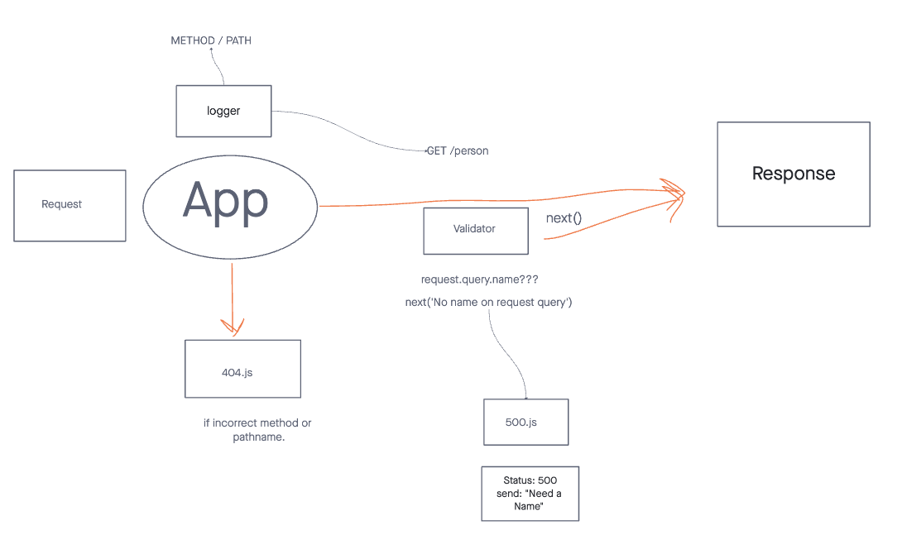

# Basic API server

REST API using Express, by creating a proper series of endpoints that perform CRUD operations on a database, using the REST standard

## Deployment

## Testing

install packages:
npm i

run test:
npm test

[Test Link](./__tests__/routes.test.js)

## UML

## Routes

    CRUD Operation: Create
    REST Method: POST
    Path: /farms
    Input: JSON Object in the Request Body
    Returns: The record that was added to the database.
    You must generate an ID and attach it to the object.
    You should verify that only the fields you define get saved as a record.
    Get All Records

    CRUD Operation: Read
    REST Method: GET
    Path: /farms
    Returns: An array of objects, each object being one entry from your database.
    Get One Record

    CRUD Operation: Read
    REST Method: GET
    Path: /farms/:id
    Returns: The object from the database, which has the id matching that which is in the path.
    Update a Record

    CRUD Operation: Update
    REST Method: PUT
    Path: /farms/:id
    Input: JSON Object in the Request Body
    Returns: The object from the database, which has the id matching that which is in the path, with the updated/changed data.
    You should verify that only the fields you define get saved as a record.
    Delete a Record

    CRUD Operation: Destroy
    REST Method: DELETE
    Path: /farms/:id
    Returns: The record from the database as it exists after you delete it (i.e. null).
